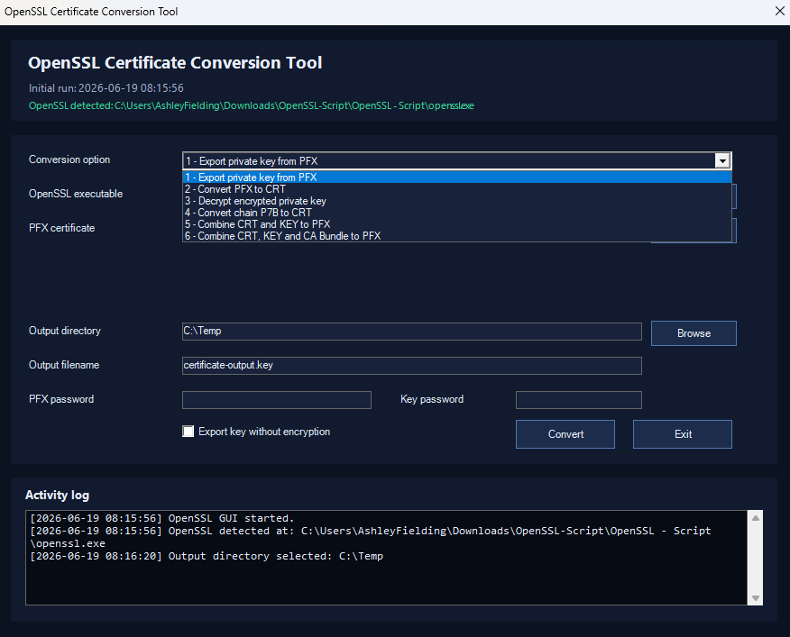

# OpenSSL Powershell Script
## This script will allow you to manage SSL Certificates using OpenSSL. Note that the script must be ran from the same location that the openssl.exe is located
## Credit (OpenSSL Binaries)
https://www.firedaemon.com/download-firedaemon-openssl

<br>



## Method 1 (Easy) - Click here to go to the latest zip folder containing both the script and OpenSSL. Simply right click OpenSSLScript_GUI.ps1 and click on 'Run with PowerShell'
[OpenSSL Powershell Script Download](https://github.com/Ashdf1992/wiki/blob/main/assets/attachments/OpenSSL-Script.zip)
#### PFX Password = Current PFX password. If you are creating a PFX, its the password you want to protect the PFX with
#### 'Export key without encryption' = dont password protect the key when exporting
#### 'Key Password' only needs to be entered if 'Export key without encryption' is unticked, or if you are creating a PFX that has a password protected key
#### This may not work if running scripts is disabled on your device

<br>

## Method 2 - Ensure you run the below within ISE, from the same directory where you have OpenSSL.exe
>Open Powershell ISE

>Run the Following
```Powershell
# =========================
# Load assemblies
# =========================
Add-Type -AssemblyName System.Windows.Forms
Add-Type -AssemblyName System.Drawing


# =========================
# Global settings
# =========================
$script:AppTitle = "OpenSSL Certificate Conversion Tool"
$script:InitialRunTime = Get-Date
$script:OpenSslExe = $null


# =========================
# Resolve OpenSSL path
# =========================
function Resolve-OpenSslPath {
    $possibleFolders = @()

    if ($PSScriptRoot) {
        $possibleFolders += $PSScriptRoot
    }

    if ($PSCommandPath) {
        $possibleFolders += Split-Path -Parent $PSCommandPath
    }

    if ($MyInvocation.MyCommand.Path) {
        $possibleFolders += Split-Path -Parent $MyInvocation.MyCommand.Path
    }

    $possibleFolders += (Get-Location).Path
    $possibleFolders = $possibleFolders | Where-Object { $_ } | Select-Object -Unique

    foreach ($folder in $possibleFolders) {
        $candidate = Join-Path $folder "openssl.exe"
        if (Test-Path $candidate) {
            return (Resolve-Path $candidate).Path
        }
    }

    return $null
}


# =========================
# Utility: Quote command argument
# =========================
function ConvertTo-QuotedArgument {
    param(
        [Parameter(Mandatory)]
        [string] $Value
    )

    if ($Value -match '[\s"]') {
        return '"' + ($Value -replace '"', '\"') + '"'
    }

    return $Value
}


# =========================
# Utility: Create temporary OpenSSL password file
# This avoids placing passwords directly in the command line.
# =========================
function New-OpenSslPasswordFile {
    param(
        [string] $Password
    )

    if ([string]::IsNullOrWhiteSpace($Password)) {
        return $null
    }

    $path = Join-Path $env:TEMP ("openssl-pass-{0}.tmp" -f ([guid]::NewGuid().ToString()))
    Set-Content -Path $path -Value $Password -Encoding ASCII -NoNewline
    return $path
}


# =========================
# Utility: Run OpenSSL
# =========================
function Invoke-OpenSslCommand {
    param(
        [Parameter(Mandatory)]
        [string] $OpenSslPath,

        [Parameter(Mandatory)]
        [string[]] $Arguments,

        [Parameter(Mandatory)]
        [scriptblock] $LogCallback
    )

    $stdoutPath = Join-Path $env:TEMP ("openssl-stdout-{0}.txt" -f ([guid]::NewGuid().ToString()))
    $stderrPath = Join-Path $env:TEMP ("openssl-stderr-{0}.txt" -f ([guid]::NewGuid().ToString()))

    try {
        $argumentLine = ($Arguments | ForEach-Object { ConvertTo-QuotedArgument $_ }) -join " "

        & $LogCallback "Running:"
        & $LogCallback "$OpenSslPath $argumentLine"
        & $LogCallback " "

        $processInfo = New-Object System.Diagnostics.ProcessStartInfo
        $processInfo.FileName = $OpenSslPath
        $processInfo.Arguments = $argumentLine
        $processInfo.WorkingDirectory = Split-Path -Parent $OpenSslPath
        $processInfo.UseShellExecute = $false
        $processInfo.RedirectStandardOutput = $true
        $processInfo.RedirectStandardError = $true
        $processInfo.CreateNoWindow = $true

        $process = New-Object System.Diagnostics.Process
        $process.StartInfo = $processInfo

        [void] $process.Start()

        $stdOut = $process.StandardOutput.ReadToEnd()
        $stdErr = $process.StandardError.ReadToEnd()

        $process.WaitForExit()

        if ($stdOut) {
            & $LogCallback "OpenSSL output:"
            & $LogCallback $stdOut
        }

        if ($stdErr) {
            & $LogCallback "OpenSSL messages:"
            & $LogCallback $stdErr
        }

        if ($process.ExitCode -ne 0) {
            throw "OpenSSL exited with code $($process.ExitCode). Review the OpenSSL messages above."
        }

        & $LogCallback "Completed successfully."
        return $true
    }
    finally {
        Remove-Item $stdoutPath, $stderrPath -ErrorAction SilentlyContinue
    }
}


# =========================
# Utility: Get default output filename
# =========================
function Get-DefaultOutputFileName {
    param(
        [Parameter(Mandatory)]
        [string] $OperationKey,

        [string] $PrimaryInput
    )

    $baseName = "certificate-output"

    if (-not [string]::IsNullOrWhiteSpace($PrimaryInput)) {
        try {
            $baseName = [System.IO.Path]::GetFileNameWithoutExtension($PrimaryInput)
        }
        catch {
            $baseName = "certificate-output"
        }
    }

    switch ($OperationKey) {
        "ExportPrivateKeyFromPfx" {
            return "$baseName.key"
        }

        "ExportCertificateFromPfx" {
            return "$baseName.crt"
        }

        "DecryptPrivateKey" {
            return "$baseName.decrypt.key"
        }

        "ConvertP7bToCrt" {
            return "$baseName.crt"
        }

        "CombineCrtKeyToPfx" {
            return "$baseName.pfx"
        }

        "CombineCrtKeyCaToPfx" {
            return "$baseName.pfx"
        }

        default {
            return "$baseName.out"
        }
    }
}


# =========================
# GUI helper functions
# =========================
function New-ModernLabel {
    param(
        [string] $Text,
        [int] $X,
        [int] $Y,
        [int] $Width = 160
    )

    $label = New-Object System.Windows.Forms.Label
    $label.Text = $Text
    $label.Location = New-Object System.Drawing.Point($X, $Y)
    $label.Size = New-Object System.Drawing.Size($Width, 22)
    $label.ForeColor = [System.Drawing.Color]::FromArgb(220, 230, 245)
    $label.BackColor = [System.Drawing.Color]::Transparent
    return $label
}


function New-ModernTextBox {
    param(
        [int] $X,
        [int] $Y,
        [int] $Width = 510,
        [bool] $Password = $false
    )

    $box = New-Object System.Windows.Forms.TextBox
    $box.Location = New-Object System.Drawing.Point($X, $Y)
    $box.Size = New-Object System.Drawing.Size($Width, 24)
    $box.BackColor = [System.Drawing.Color]::FromArgb(24, 34, 58)
    $box.ForeColor = [System.Drawing.Color]::FromArgb(235, 241, 252)
    $box.BorderStyle = "FixedSingle"

    if ($Password) {
        $box.UseSystemPasswordChar = $true
    }

    return $box
}


function New-ModernButton {
    param(
        [string] $Text,
        [int] $X,
        [int] $Y,
        [int] $Width = 95,
        [int] $Height = 28
    )

    $button = New-Object System.Windows.Forms.Button
    $button.Text = $Text
    $button.Location = New-Object System.Drawing.Point($X, $Y)
    $button.Size = New-Object System.Drawing.Size($Width, $Height)
    $button.FlatStyle = "Flat"
    $button.FlatAppearance.BorderColor = [System.Drawing.Color]::FromArgb(80, 120, 180)
    $button.BackColor = [System.Drawing.Color]::FromArgb(28, 45, 75)
    $button.ForeColor = [System.Drawing.Color]::FromArgb(235, 241, 252)
    return $button
}


function Add-LogLine {
    param(
        [Parameter(Mandatory)]
        [System.Windows.Forms.TextBox] $LogBox,

        [AllowEmptyString()]
        [AllowNull()]
        [string] $Message
    )

    $timestamp = (Get-Date).ToString("yyyy-MM-dd HH:mm:ss")

    if ($null -eq $Message) {
        $Message = ""
    }

    if ([string]::IsNullOrWhiteSpace($Message)) {
        $LogBox.AppendText("`r`n")
    }
    else {
        $LogBox.AppendText("[$timestamp] $Message`r`n")
    }
}


# =========================
# File/folder browse helpers
# =========================
function Select-InputFile {
    param(
        [string] $Title = "Select file",
        [string] $Filter = "All files (*.*)|*.*"
    )

    $dialog = New-Object System.Windows.Forms.OpenFileDialog
    $dialog.Title = $Title
    $dialog.Filter = $Filter
    $dialog.CheckFileExists = $true
    $dialog.Multiselect = $false

    if ($dialog.ShowDialog() -eq [System.Windows.Forms.DialogResult]::OK) {
        return $dialog.FileName
    }

    return $null
}


function Select-OutputFolder {
    param(
        [string] $Description = "Select output folder"
    )

    $dialog = New-Object System.Windows.Forms.FolderBrowserDialog
    $dialog.Description = $Description
    $dialog.ShowNewFolderButton = $true

    if ($dialog.ShowDialog() -eq [System.Windows.Forms.DialogResult]::OK) {
        return $dialog.SelectedPath
    }

    return $null
}


# =========================
# Main GUI
# =========================
function Show-OpenSslGui {
    $script:OpenSslExe = Resolve-OpenSslPath

    $form = New-Object System.Windows.Forms.Form
    $form.Text = $script:AppTitle
    $form.StartPosition = "CenterScreen"
    $form.Size = New-Object System.Drawing.Size(900, 720)
    $form.FormBorderStyle = "FixedDialog"
    $form.MaximizeBox = $false
    $form.MinimizeBox = $false
    $form.BackColor = [System.Drawing.Color]::FromArgb(11, 18, 32)
    $form.Topmost = $false

    # -------------------------
    # Header card
    # -------------------------
    $headerPanel = New-Object System.Windows.Forms.Panel
    $headerPanel.Location = New-Object System.Drawing.Point(16, 16)
    $headerPanel.Size = New-Object System.Drawing.Size(850, 90)
    $headerPanel.BackColor = [System.Drawing.Color]::FromArgb(17, 26, 46)
    $form.Controls.Add($headerPanel)

    $titleLabel = New-Object System.Windows.Forms.Label
    $titleLabel.Text = "OpenSSL Certificate Conversion Tool"
    $titleLabel.Location = New-Object System.Drawing.Point(16, 12)
    $titleLabel.Size = New-Object System.Drawing.Size(600, 28)
    $titleLabel.Font = New-Object System.Drawing.Font("Segoe UI", 14, [System.Drawing.FontStyle]::Bold)
    $titleLabel.ForeColor = [System.Drawing.Color]::FromArgb(231, 238, 252)
    $titleLabel.BackColor = [System.Drawing.Color]::Transparent
    $headerPanel.Controls.Add($titleLabel)

    $subLabel = New-Object System.Windows.Forms.Label
    $subLabel.Text = "Initial run: $($script:InitialRunTime.ToString('yyyy-MM-dd HH:mm:ss'))"
    $subLabel.Location = New-Object System.Drawing.Point(18, 45)
    $subLabel.Size = New-Object System.Drawing.Size(760, 20)
    $subLabel.Font = New-Object System.Drawing.Font("Segoe UI", 9)
    $subLabel.ForeColor = [System.Drawing.Color]::FromArgb(159, 176, 208)
    $subLabel.BackColor = [System.Drawing.Color]::Transparent
    $headerPanel.Controls.Add($subLabel)

    $opensslStatusLabel = New-Object System.Windows.Forms.Label
    $opensslStatusLabel.Location = New-Object System.Drawing.Point(18, 66)
    $opensslStatusLabel.Size = New-Object System.Drawing.Size(800, 18)
    $opensslStatusLabel.Font = New-Object System.Drawing.Font("Segoe UI", 8)
    $opensslStatusLabel.BackColor = [System.Drawing.Color]::Transparent

    if ($script:OpenSslExe) {
        $opensslStatusLabel.Text = "OpenSSL detected: $script:OpenSslExe"
        $opensslStatusLabel.ForeColor = [System.Drawing.Color]::FromArgb(54, 211, 153)
    }
    else {
        $opensslStatusLabel.Text = "OpenSSL was not found automatically. Use the Browse button below to select openssl.exe."
        $opensslStatusLabel.ForeColor = [System.Drawing.Color]::FromArgb(248, 113, 113)
    }

    $headerPanel.Controls.Add($opensslStatusLabel)


    # -------------------------
    # Main card
    # -------------------------
    $mainPanel = New-Object System.Windows.Forms.Panel
    $mainPanel.Location = New-Object System.Drawing.Point(16, 122)
    $mainPanel.Size = New-Object System.Drawing.Size(850, 365)
    $mainPanel.BackColor = [System.Drawing.Color]::FromArgb(17, 26, 46)
    $form.Controls.Add($mainPanel)


    # -------------------------
    # Operation picker
    # -------------------------
    $operationLabel = New-ModernLabel -Text "Conversion option" -X 18 -Y 20
    $mainPanel.Controls.Add($operationLabel)

    $operationCombo = New-Object System.Windows.Forms.ComboBox
    $operationCombo.Location = New-Object System.Drawing.Point(190, 18)
    $operationCombo.Size = New-Object System.Drawing.Size(610, 26)
    $operationCombo.DropDownStyle = "DropDownList"
    $operationCombo.BackColor = [System.Drawing.Color]::FromArgb(24, 34, 58)
    $operationCombo.ForeColor = [System.Drawing.Color]::FromArgb(235, 241, 252)
    $mainPanel.Controls.Add($operationCombo)

    $operationItems = @(
        [pscustomobject]@{
            Key         = "ExportPrivateKeyFromPfx"
            DisplayName = "1 - Export private key from PFX"
        },
        [pscustomobject]@{
            Key         = "ExportCertificateFromPfx"
            DisplayName = "2 - Convert PFX to CRT"
        },
        [pscustomobject]@{
            Key         = "DecryptPrivateKey"
            DisplayName = "3 - Decrypt encrypted private key"
        },
        [pscustomobject]@{
            Key         = "ConvertP7bToCrt"
            DisplayName = "4 - Convert chain P7B to CRT"
        },
        [pscustomobject]@{
            Key         = "CombineCrtKeyToPfx"
            DisplayName = "5 - Combine CRT and KEY to PFX"
        },
        [pscustomobject]@{
            Key         = "CombineCrtKeyCaToPfx"
            DisplayName = "6 - Combine CRT, KEY and CA Bundle to PFX"
        }
    )

    foreach ($item in $operationItems) {
        [void] $operationCombo.Items.Add($item.DisplayName)
    }

    $operationCombo.SelectedIndex = 0


    # -------------------------
    # OpenSSL path
    # -------------------------
    $opensslLabel = New-ModernLabel -Text "OpenSSL executable" -X 18 -Y 58
    $mainPanel.Controls.Add($opensslLabel)

    $opensslBox = New-ModernTextBox -X 190 -Y 56 -Width 510
    if ($script:OpenSslExe) {
        $opensslBox.Text = $script:OpenSslExe
    }
    $mainPanel.Controls.Add($opensslBox)

    $browseOpenSslButton = New-ModernButton -Text "Browse" -X 710 -Y 54
    $mainPanel.Controls.Add($browseOpenSslButton)


    # -------------------------
    # Primary input
    # -------------------------
    $primaryInputLabel = New-ModernLabel -Text "Source certificate" -X 18 -Y 96
    $mainPanel.Controls.Add($primaryInputLabel)

    $primaryInputBox = New-ModernTextBox -X 190 -Y 94 -Width 510
    $mainPanel.Controls.Add($primaryInputBox)

    $browsePrimaryButton = New-ModernButton -Text "Browse" -X 710 -Y 92
    $mainPanel.Controls.Add($browsePrimaryButton)


    # -------------------------
    # Private key input
    # -------------------------
    $keyInputLabel = New-ModernLabel -Text "Private key" -X 18 -Y 134
    $mainPanel.Controls.Add($keyInputLabel)

    $keyInputBox = New-ModernTextBox -X 190 -Y 132 -Width 510
    $mainPanel.Controls.Add($keyInputBox)

    $browseKeyButton = New-ModernButton -Text "Browse" -X 710 -Y 130
    $mainPanel.Controls.Add($browseKeyButton)


    # -------------------------
    # CA bundle input
    # -------------------------
    $caBundleLabel = New-ModernLabel -Text "CA bundle / chain" -X 18 -Y 172
    $mainPanel.Controls.Add($caBundleLabel)

    $caBundleBox = New-ModernTextBox -X 190 -Y 170 -Width 510
    $mainPanel.Controls.Add($caBundleBox)

    $browseCaButton = New-ModernButton -Text "Browse" -X 710 -Y 168
    $mainPanel.Controls.Add($browseCaButton)


    # -------------------------
    # Output directory
    # -------------------------
    $outputFolderLabel = New-ModernLabel -Text "Output directory" -X 18 -Y 210
    $mainPanel.Controls.Add($outputFolderLabel)

    $outputFolderBox = New-ModernTextBox -X 190 -Y 208 -Width 510
    $outputFolderBox.Text = [Environment]::GetFolderPath("Desktop")
    $mainPanel.Controls.Add($outputFolderBox)

    $browseOutputButton = New-ModernButton -Text "Browse" -X 710 -Y 206
    $mainPanel.Controls.Add($browseOutputButton)


    # -------------------------
    # Output filename
    # -------------------------
    $outputFileLabel = New-ModernLabel -Text "Output filename" -X 18 -Y 248
    $mainPanel.Controls.Add($outputFileLabel)

    $outputFileBox = New-ModernTextBox -X 190 -Y 246 -Width 510
    $mainPanel.Controls.Add($outputFileBox)


    # -------------------------
    # Passwords
    # -------------------------
    $inputPasswordLabel = New-ModernLabel -Text "Input password" -X 18 -Y 286
    $mainPanel.Controls.Add($inputPasswordLabel)

    $inputPasswordBox = New-ModernTextBox -X 190 -Y 284 -Width 210 -Password $true
    $mainPanel.Controls.Add($inputPasswordBox)

    $outputPasswordLabel = New-ModernLabel -Text "Output password" -X 430 -Y 286 -Width 130
    $mainPanel.Controls.Add($outputPasswordLabel)

    $outputPasswordBox = New-ModernTextBox -X 560 -Y 284 -Width 140 -Password $true
    $mainPanel.Controls.Add($outputPasswordBox)

    $unencryptedKeyCheck = New-Object System.Windows.Forms.CheckBox
    $unencryptedKeyCheck.Text = "Export key without encryption"
    $unencryptedKeyCheck.Location = New-Object System.Drawing.Point(190, 318)
    $unencryptedKeyCheck.Size = New-Object System.Drawing.Size(260, 22)
    $unencryptedKeyCheck.ForeColor = [System.Drawing.Color]::FromArgb(220, 230, 245)
    $unencryptedKeyCheck.BackColor = [System.Drawing.Color]::Transparent
    $mainPanel.Controls.Add($unencryptedKeyCheck)


    # -------------------------
    # Action buttons
    # -------------------------
    $convertButton = New-ModernButton -Text "Convert" -X 560 -Y 316 -Width 110 -Height 32
    $mainPanel.Controls.Add($convertButton)

    $exitButton = New-ModernButton -Text "Exit" -X 690 -Y 316 -Width 110 -Height 32
    $mainPanel.Controls.Add($exitButton)


    # -------------------------
    # Log panel
    # -------------------------
    $logPanel = New-Object System.Windows.Forms.Panel
    $logPanel.Location = New-Object System.Drawing.Point(16, 502)
    $logPanel.Size = New-Object System.Drawing.Size(850, 160)
    $logPanel.BackColor = [System.Drawing.Color]::FromArgb(17, 26, 46)
    $form.Controls.Add($logPanel)

    $logTitle = New-Object System.Windows.Forms.Label
    $logTitle.Text = "Activity log"
    $logTitle.Location = New-Object System.Drawing.Point(14, 10)
    $logTitle.Size = New-Object System.Drawing.Size(250, 20)
    $logTitle.Font = New-Object System.Drawing.Font("Segoe UI", 10, [System.Drawing.FontStyle]::Bold)
    $logTitle.ForeColor = [System.Drawing.Color]::FromArgb(231, 238, 252)
    $logTitle.BackColor = [System.Drawing.Color]::Transparent
    $logPanel.Controls.Add($logTitle)

    $logBox = New-Object System.Windows.Forms.TextBox
    $logBox.Location = New-Object System.Drawing.Point(16, 36)
    $logBox.Size = New-Object System.Drawing.Size(818, 106)
    $logBox.Multiline = $true
    $logBox.ScrollBars = "Vertical"
    $logBox.ReadOnly = $true
    $logBox.BackColor = [System.Drawing.Color]::FromArgb(7, 11, 20)
    $logBox.ForeColor = [System.Drawing.Color]::FromArgb(231, 238, 252)
    $logBox.BorderStyle = "FixedSingle"
    $logBox.Font = New-Object System.Drawing.Font("Consolas", 9)
    $logPanel.Controls.Add($logBox)


    # =========================
    # Operation UI refresh
    # =========================
    function Get-SelectedOperationKey {
        $selectedDisplayName = [string] $operationCombo.SelectedItem
        return ($operationItems | Where-Object { $_.DisplayName -eq $selectedDisplayName }).Key
    }


    function Update-FormForOperation {
        $operationKey = Get-SelectedOperationKey

        $keyInputLabel.Visible = $false
        $keyInputBox.Visible = $false
        $browseKeyButton.Visible = $false

        $caBundleLabel.Visible = $false
        $caBundleBox.Visible = $false
        $browseCaButton.Visible = $false

        $inputPasswordLabel.Visible = $true
        $inputPasswordBox.Visible = $true

        $outputPasswordLabel.Visible = $false
        $outputPasswordBox.Visible = $false

        $unencryptedKeyCheck.Visible = $false

        switch ($operationKey) {
            "ExportPrivateKeyFromPfx" {
                $primaryInputLabel.Text = "PFX certificate"
                $inputPasswordLabel.Text = "PFX password"
                $outputPasswordLabel.Text = "Key password"
                $outputPasswordLabel.Visible = $true
                $outputPasswordBox.Visible = $true
                $unencryptedKeyCheck.Visible = $true
            }

            "ExportCertificateFromPfx" {
                $primaryInputLabel.Text = "PFX certificate"
                $inputPasswordLabel.Text = "PFX password"
            }

            "DecryptPrivateKey" {
                $primaryInputLabel.Text = "Encrypted KEY file"
                $inputPasswordLabel.Text = "Key password"
            }

            "ConvertP7bToCrt" {
                $primaryInputLabel.Text = "P7B chain file"
                $inputPasswordLabel.Visible = $false
                $inputPasswordBox.Visible = $false
            }

            "CombineCrtKeyToPfx" {
                $primaryInputLabel.Text = "CRT certificate"

                $keyInputLabel.Text = "Private key"
                $keyInputLabel.Visible = $true
                $keyInputBox.Visible = $true
                $browseKeyButton.Visible = $true

                $inputPasswordLabel.Text = "Key password"
                $outputPasswordLabel.Text = "PFX password"
                $outputPasswordLabel.Visible = $true
                $outputPasswordBox.Visible = $true
            }

            "CombineCrtKeyCaToPfx" {
                $primaryInputLabel.Text = "CRT certificate"

                $keyInputLabel.Text = "Private key"
                $keyInputLabel.Visible = $true
                $keyInputBox.Visible = $true
                $browseKeyButton.Visible = $true

                $caBundleLabel.Text = "CA bundle / chain"
                $caBundleLabel.Visible = $true
                $caBundleBox.Visible = $true
                $browseCaButton.Visible = $true

                $inputPasswordLabel.Text = "Key password"
                $outputPasswordLabel.Text = "PFX password"
                $outputPasswordLabel.Visible = $true
                $outputPasswordBox.Visible = $true
            }
        }

        if ([string]::IsNullOrWhiteSpace($outputFileBox.Text)) {
            $outputFileBox.Text = Get-DefaultOutputFileName -OperationKey $operationKey -PrimaryInput $primaryInputBox.Text
        }
    }


    # =========================
    # Browse button events
    # =========================
    $browseOpenSslButton.Add_Click({
        $file = Select-InputFile -Title "Select openssl.exe" -Filter "OpenSSL executable (openssl.exe)|openssl.exe|Executable files (*.exe)|*.exe|All files (*.*)|*.*"
        if ($file) {
            $opensslBox.Text = $file
            $script:OpenSslExe = $file
            $opensslStatusLabel.Text = "OpenSSL selected: $file"
            $opensslStatusLabel.ForeColor = [System.Drawing.Color]::FromArgb(54, 211, 153)
            Add-LogLine -LogBox $logBox -Message "OpenSSL selected: $file"
        }
    })


    $browsePrimaryButton.Add_Click({
        $operationKey = Get-SelectedOperationKey

        $filter = "All files (*.*)|*.*"
        $title = "Select source file"

        switch ($operationKey) {
            "ExportPrivateKeyFromPfx" {
                $filter = "PFX files (*.pfx;*.p12)|*.pfx;*.p12|All files (*.*)|*.*"
                $title = "Select PFX certificate"
            }

            "ExportCertificateFromPfx" {
                $filter = "PFX files (*.pfx;*.p12)|*.pfx;*.p12|All files (*.*)|*.*"
                $title = "Select PFX certificate"
            }

            "DecryptPrivateKey" {
                $filter = "KEY files (*.key)|*.key|PEM files (*.pem)|*.pem|All files (*.*)|*.*"
                $title = "Select encrypted private key"
            }

            "ConvertP7bToCrt" {
                $filter = "P7B files (*.p7b;*.p7c)|*.p7b;*.p7c|All files (*.*)|*.*"
                $title = "Select P7B chain file"
            }

            "CombineCrtKeyToPfx" {
                $filter = "Certificate files (*.crt;*.cer;*.pem)|*.crt;*.cer;*.pem|All files (*.*)|*.*"
                $title = "Select CRT certificate"
            }

            "CombineCrtKeyCaToPfx" {
                $filter = "Certificate files (*.crt;*.cer;*.pem)|*.crt;*.cer;*.pem|All files (*.*)|*.*"
                $title = "Select CRT certificate"
            }
        }

        $file = Select-InputFile -Title $title -Filter $filter
        if ($file) {
            $primaryInputBox.Text = $file

            if ([string]::IsNullOrWhiteSpace($outputFileBox.Text) -or $outputFileBox.Text -eq "certificate-output.out") {
                $outputFileBox.Text = Get-DefaultOutputFileName -OperationKey $operationKey -PrimaryInput $file
            }
            else {
                $outputFileBox.Text = Get-DefaultOutputFileName -OperationKey $operationKey -PrimaryInput $file
            }

            Add-LogLine -LogBox $logBox -Message "Source selected: $file"
        }
    })


    $browseKeyButton.Add_Click({
        $file = Select-InputFile -Title "Select private key" -Filter "KEY files (*.key)|*.key|PEM files (*.pem)|*.pem|All files (*.*)|*.*"
        if ($file) {
            $keyInputBox.Text = $file
            Add-LogLine -LogBox $logBox -Message "Private key selected: $file"
        }
    })


    $browseCaButton.Add_Click({
        $file = Select-InputFile -Title "Select CA bundle / chain" -Filter "Certificate files (*.crt;*.cer;*.pem)|*.crt;*.cer;*.pem|All files (*.*)|*.*"
        if ($file) {
            $caBundleBox.Text = $file
            Add-LogLine -LogBox $logBox -Message "CA bundle selected: $file"
        }
    })


    $browseOutputButton.Add_Click({
        $folder = Select-OutputFolder -Description "Select output directory"
        if ($folder) {
            $outputFolderBox.Text = $folder
            Add-LogLine -LogBox $logBox -Message "Output directory selected: $folder"
        }
    })


    # =========================
    # Operation changed
    # =========================
    $operationCombo.Add_SelectedIndexChanged({
        $outputFileBox.Text = ""
        Update-FormForOperation
    })


    # =========================
    # Exit button
    # =========================
    $exitButton.Add_Click({
        $form.Close()
    })


    # =========================
    # Convert button
    # =========================
    $convertButton.Add_Click({
        $temporaryPasswordFiles = @()

        try {
            $operationKey = Get-SelectedOperationKey

            $openSslPath = $opensslBox.Text.Trim()
            $primaryInput = $primaryInputBox.Text.Trim()
            $keyInput = $keyInputBox.Text.Trim()
            $caBundle = $caBundleBox.Text.Trim()
            $outputFolder = $outputFolderBox.Text.Trim()
            $outputFileName = $outputFileBox.Text.Trim()
            $inputPassword = $inputPasswordBox.Text
            $outputPassword = $outputPasswordBox.Text

            Add-LogLine -LogBox $logBox -Message "Selected operation: $operationKey"

            if ([string]::IsNullOrWhiteSpace($openSslPath) -or -not (Test-Path $openSslPath)) {
                throw "OpenSSL executable was not found. Please select openssl.exe."
            }

            if ([string]::IsNullOrWhiteSpace($primaryInput) -or -not (Test-Path $primaryInput)) {
                throw "The source file was not found. Please select a valid source file."
            }

            if ([string]::IsNullOrWhiteSpace($outputFolder)) {
                throw "Please select an output directory."
            }

            if (-not (Test-Path $outputFolder)) {
                New-Item -Path $outputFolder -ItemType Directory -Force | Out-Null
                Add-LogLine -LogBox $logBox -Message "Created output directory: $outputFolder"
            }

            if ([string]::IsNullOrWhiteSpace($outputFileName)) {
                $outputFileName = Get-DefaultOutputFileName -OperationKey $operationKey -PrimaryInput $primaryInput
                $outputFileBox.Text = $outputFileName
            }

            $invalidChars = [System.IO.Path]::GetInvalidFileNameChars()
            foreach ($char in $invalidChars) {
                if ($outputFileName.Contains($char)) {
                    throw "The output filename contains an invalid character: $char"
                }
            }

            $outputPath = Join-Path $outputFolder $outputFileName

            $inputPasswordFile = New-OpenSslPasswordFile -Password $inputPassword
            if ($inputPasswordFile) {
                $temporaryPasswordFiles += $inputPasswordFile
            }

            $outputPasswordFile = New-OpenSslPasswordFile -Password $outputPassword
            if ($outputPasswordFile) {
                $temporaryPasswordFiles += $outputPasswordFile
            }

            $args = @()

            switch ($operationKey) {
                "ExportPrivateKeyFromPfx" {
                    if (-not $unencryptedKeyCheck.Checked -and [string]::IsNullOrWhiteSpace($outputPassword)) {
                        throw "Please enter a key output password, or tick 'Export key without encryption'."
                    }

                    $args = @(
                        "pkcs12",
                        "-in", $primaryInput,
                        "-nocerts",
                        "-out", $outputPath
                    )

                    if ($inputPasswordFile) {
                        $args += @("-passin", "file:$inputPasswordFile")
                    }

                    if ($unencryptedKeyCheck.Checked) {
                        $args += "-nodes"
                    }
                    else {
                        $args += @("-passout", "file:$outputPasswordFile")
                    }
                }

                "ExportCertificateFromPfx" {
                    $args = @(
                        "pkcs12",
                        "-in", $primaryInput,
                        "-clcerts",
                        "-nokeys",
                        "-out", $outputPath
                    )

                    if ($inputPasswordFile) {
                        $args += @("-passin", "file:$inputPasswordFile")
                    }
                }

                "DecryptPrivateKey" {
                    $args = @(
                        "rsa",
                        "-in", $primaryInput,
                        "-outform", "PEM",
                        "-out", $outputPath
                    )

                    if ($inputPasswordFile) {
                        $args += @("-passin", "file:$inputPasswordFile")
                    }
                }

                "ConvertP7bToCrt" {
                    $args = @(
                        "pkcs7",
                        "-print_certs",
                        "-in", $primaryInput,
                        "-out", $outputPath
                    )
                }

                "CombineCrtKeyToPfx" {
                    if ([string]::IsNullOrWhiteSpace($keyInput) -or -not (Test-Path $keyInput)) {
                        throw "Please select a valid private key file."
                    }

                    if ([string]::IsNullOrWhiteSpace($outputPassword)) {
                        throw "Please enter an output PFX password."
                    }

                    $args = @(
                        "pkcs12",
                        "-export",
                        "-out", $outputPath,
                        "-inkey", $keyInput,
                        "-in", $primaryInput,
                        "-passout", "file:$outputPasswordFile"
                    )

                    if ($inputPasswordFile) {
                        $args += @("-passin", "file:$inputPasswordFile")
                    }
                }

                "CombineCrtKeyCaToPfx" {
                    if ([string]::IsNullOrWhiteSpace($keyInput) -or -not (Test-Path $keyInput)) {
                        throw "Please select a valid private key file."
                    }

                    if ([string]::IsNullOrWhiteSpace($caBundle) -or -not (Test-Path $caBundle)) {
                        throw "Please select a valid CA bundle / chain file."
                    }

                    if ([string]::IsNullOrWhiteSpace($outputPassword)) {
                        throw "Please enter an output PFX password."
                    }

                    $args = @(
                        "pkcs12",
                        "-export",
                        "-out", $outputPath,
                        "-inkey", $keyInput,
                        "-in", $primaryInput,
                        "-certfile", $caBundle,
                        "-passout", "file:$outputPasswordFile"
                    )

                    if ($inputPasswordFile) {
                        $args += @("-passin", "file:$inputPasswordFile")
                    }
                }

                default {
                    throw "Unsupported operation selected."
                }
            }

            Add-LogLine -LogBox $logBox -Message "Output path: $outputPath"

            $result = Invoke-OpenSslCommand -OpenSslPath $openSslPath -Arguments $args -LogCallback {
                param($line)
                Add-LogLine -LogBox $logBox -Message $line
            }

            if ($result -and (Test-Path $outputPath)) {
                [System.Windows.Forms.MessageBox]::Show(
                    "Conversion completed successfully.`n`nOutput file:`n$outputPath",
                    "Success",
                    [System.Windows.Forms.MessageBoxButtons]::OK,
                    [System.Windows.Forms.MessageBoxIcon]::Information
                ) | Out-Null

                Add-LogLine -LogBox $logBox -Message "Generated file: $outputPath"

                $openOutput = [System.Windows.Forms.MessageBox]::Show(
                    "Would you like to open the output folder?",
                    "Open output folder",
                    [System.Windows.Forms.MessageBoxButtons]::YesNo,
                    [System.Windows.Forms.MessageBoxIcon]::Question
                )

                if ($openOutput -eq [System.Windows.Forms.DialogResult]::Yes) {
                    Invoke-Item $outputFolder
                }
            }
            elseif ($result) {
                [System.Windows.Forms.MessageBox]::Show(
                    "OpenSSL completed, but the expected output file was not found:`n$outputPath",
                    "Completed with warning",
                    [System.Windows.Forms.MessageBoxButtons]::OK,
                    [System.Windows.Forms.MessageBoxIcon]::Warning
                ) | Out-Null
            }
        }
        catch {
            $message = $_.Exception.Message
            Add-LogLine -LogBox $logBox -Message "ERROR: $message"

            [System.Windows.Forms.MessageBox]::Show(
                $message,
                "OpenSSL conversion failed",
                [System.Windows.Forms.MessageBoxButtons]::OK,
                [System.Windows.Forms.MessageBoxIcon]::Error
            ) | Out-Null
        }
        finally {
            foreach ($file in $temporaryPasswordFiles) {
                Remove-Item $file -Force -ErrorAction SilentlyContinue
            }
        }
    })


    # =========================
    # Initial UI state
    # =========================
    Update-FormForOperation

    Add-LogLine -LogBox $logBox -Message "OpenSSL GUI started."
    if ($script:OpenSslExe) {
        Add-LogLine -LogBox $logBox -Message "OpenSSL detected at: $script:OpenSslExe"
    }
    else {
        Add-LogLine -LogBox $logBox -Message "OpenSSL was not detected automatically."
    }

    [void] $form.ShowDialog()
}


# =========================
# Start application
# =========================
Show-OpenSslGui
```


