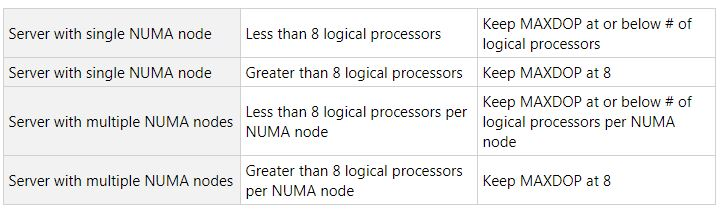
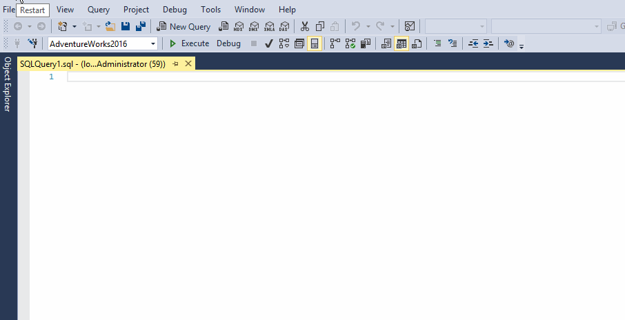

# Microsoft SQL Server Cheat Sheet

<br>

## SQL DB compatibility_levels
```SQL
SELECT name, compatibility_level
FROM sys.databases;
```
> NOTE:Website for Compatibility Levels here:
https://sqlperformance.com/2019/01/sql-performance/compatibility-levels-and-cardinality-estimation-primer
https://sqlserverbuilds.blogspot.com/2014/01/sql-server-internal-database-versions.html


<br>

## SQL Server patch level
```SQL
Select @@version;
```
> You can find the latest patch levels using the below 2 URLS
https://sqlserverbuilds.blogspot.com/#sql2012x
https://support.microsoft.com/en-gb/help/321185/how-to-determine-the-version-edition-and-update-level-of-sql-server-an

<br>

## Expensive queries
```SQL
SELECT TOP 10 SUBSTRING(qt.TEXT, (qs.statement_start_offset/2)+1,
((CASE qs.statement_end_offset
WHEN -1 THEN DATALENGTH(qt.TEXT)
ELSE qs.statement_end_offset
END - qs.statement_start_offset)/2)+1),
qs.execution_count,
qs.total_logical_reads, qs.last_logical_reads,
qs.total_logical_writes, qs.last_logical_writes,
qs.total_worker_time,
qs.last_worker_time,
qs.total_elapsed_time/1000000 total_elapsed_time_in_S,
qs.last_elapsed_time/1000000 last_elapsed_time_in_S,
qs.last_execution_time,
qp.query_plan
FROM sys.dm_exec_query_stats qs
CROSS APPLY sys.dm_exec_sql_text(qs.sql_handle) qt
CROSS APPLY sys.dm_exec_query_plan(qs.plan_handle) qp
ORDER BY qs.total_logical_reads DESC -- logical reads
-- ORDER BY qs.total_logical_writes DESC -- logical writes
-- ORDER BY qs.total_worker_time DESC -- CPU time
```
> You can change the order by commenting out and uncommenting the 'ORDER BY' lines at the bottom of the query.

<br>

## Expensive queries MK.II
```SQL
SELECT TOP(10) qs.execution_count AS [Execution Count],
(qs.total_logical_reads)*8/1024.0 AS [Total Logical Reads (MB)],
(qs.total_logical_reads/qs.execution_count)*8/1024.0 AS [Avg Logical Reads (MB)],
(qs.total_worker_time)/1000.0 AS [Total Worker Time (s)],
(qs.total_worker_time/qs.execution_count)/1000.0 AS [Avg Worker Time (s)],
(qs.total_elapsed_time)/1000.0 AS [Total Elapsed Time (s)],
(qs.total_elapsed_time/qs.execution_count)/1000.0 AS [Avg Elapsed Time (s)],
qs.creation_time AS [Creation Time]
,t.text AS [Complete Query Text], qp.query_plan AS [Query Plan]
FROM sys.dm_exec_query_stats AS qs WITH (NOLOCK)
CROSS APPLY sys.dm_exec_sql_text(plan_handle) AS t
CROSS APPLY sys.dm_exec_query_plan(plan_handle) AS qp
WHERE t.dbid = DB_ID()
-- ORDER BY qs.execution_count DESC OPTION (RECOMPILE);-- frequently ran query
-- ORDER BY [Total Logical Reads (MB)] DESC OPTION (RECOMPILE);-- High Disk Reading query
ORDER BY [Avg Worker Time (s)] DESC OPTION (RECOMPILE);-- High CPU query
-- ORDER BY [Avg Elapsed Time (s)] DESC OPTION (RECOMPILE);-- Long Running query
```

<br>

## High CPU usage Active Expensive Queries
```SQL
SELECT TOP 10 s.session_id,
           r.status,
           r.cpu_time,
           r.logical_reads,
           r.reads,
           r.writes,
           r.total_elapsed_time / (1000 * 60) 'Elaps M',
           SUBSTRING(st.TEXT, (r.statement_start_offset / 2) + 1,
           ((CASE r.statement_end_offset
                WHEN -1 THEN DATALENGTH(st.TEXT)
                ELSE r.statement_end_offset
            END - r.statement_start_offset) / 2) + 1) AS statement_text,
           COALESCE(QUOTENAME(DB_NAME(st.dbid)) + N'.' + QUOTENAME(OBJECT_SCHEMA_NAME(st.objectid, st.dbid)) 
           + N'.' + QUOTENAME(OBJECT_NAME(st.objectid, st.dbid)), '') AS command_text,
           r.command,
           s.login_name,
           s.host_name,
           s.program_name,
           s.last_request_end_time,
           s.login_time,
           r.open_transaction_count
FROM sys.dm_exec_sessions AS s
JOIN sys.dm_exec_requests AS r ON r.session_id = s.session_id CROSS APPLY sys.Dm_exec_sql_text(r.sql_handle) AS st
WHERE r.session_id != @@SPID
ORDER BY r.cpu_time DESC
```

<br>

## SQL DB index fragmentation
```SQL
SELECT dbschemas.[name] as 'Schema', 
    dbtables.[name] as 'Table', 
    dbindexes.[name] as 'Index',
    indexstats.alloc_unit_type_desc,
    indexstats.avg_fragmentation_in_percent,
    indexstats.page_count
FROM sys.dm_db_index_physical_stats (DB_ID(), NULL, NULL, NULL, NULL) AS indexstats
INNER JOIN sys.tables dbtables on dbtables.[object_id] = indexstats.[object_id]
INNER JOIN sys.schemas dbschemas on dbtables.[schema_id] = dbschemas.[schema_id]
INNER JOIN sys.indexes AS dbindexes ON dbindexes.[object_id] = indexstats.[object_id]
    AND indexstats.index_id = dbindexes.index_id
WHERE indexstats.database_id = DB_ID()
ORDER BY indexstats.avg_fragmentation_in_percent desc
```
> NOTE:
If index fragmentation is above 30% = Rebuild DB Indexes
If below 30% = Reindexing 
Both Rebuilding and Reindexing are really heavy on CPU tho so best done out of hours.

<br>

## CPU Ring Buffers
```SQL
/* CPU ring buffers */
declare @ts_now bigint
select @ts_now = ms_ticks from
sys.dm_os_sys_info
select record_id, dateadd (ms, (y.[timestamp] -@ts_now), GETDATE()) as EventTime,
SQLProcessUtilization,
SystemIdle,
100 - SystemIdle - SQLProcessUtilization as OtherProcessUtilization
from (
select
record.value('(./Record/@id)[1]', 'int') as record_id,
record.value('(./Record/SchedulerMonitorEvent/SystemHealth/SystemIdle)[1]', 'int')
as SystemIdle,
record.value('(./Record/SchedulerMonitorEvent/SystemHealth/ProcessUtilization)[1]',
'int') as SQLProcessUtilization,
timestamp
from (
select timestamp, convert(xml, record) as record
from sys.dm_os_ring_buffers
where ring_buffer_type = N'RING_BUFFER_SCHEDULER_MONITOR'
and record like '%<SystemHealth>%') as x
) as y
order by record_id desc
```
<br>


## SPBlitz
### Run First (sp_Blitz.sql)
[sp_Blitz Download](https://github.com/Ashdf1992/wiki/blob/main/assets/attachments/sp_Blitz.sql)

### Version 1 SPBlitz Server Health Check
> SQL Server healthcheck
```SQL
sp_blitz;
GO
```

### Version 2 SPBlitz with Server Info
> Adds additional rows at priority 250 with server configuration
```SQL
sp_blitz @CheckServerInfo = 1;
GO
```

### Version 3 SPBlitz Critical Issues Only
> Ignore everything over priority 50, "only critical issues"
```SQL
sp_blitz @IgnorePrioritiesAbove = 50;
GO
```

### Version 4 SPBlitz Disable Checking User Databases
> Disables checks inside of user databases
```SQL
sp_blitz @CheckUserDatabaseObjects = 0;
GO
```

### Version 5 SPBlitz Check User Databases (if Number of DBs is greater than 50)
> Required for checking inside user databases if there's more than 50
```SQL
sp_blitz @BringThePain = 1;
GO
```

<br>

## SPBlitzCache
### Run First (sp_BlitzCache.sql)
[sp_BlitzCache Download](https://github.com/Ashdf1992/wiki/blob/main/assets/attachments/sp_BlitzCache.sql)

### Version 1 SPBlitzCache Standard
> Looks at the plan cache and displays the 10 most expensive queries sorted by cumulative CPU run time
```SQL
sp_blitzcache;
GO
```

### Version 2 SPBlitzCache Exclude XML (easier working with excel)
> Doesn't return XML fields that make copying into Excel awkward
```SQL
sp_blitzcache @ExportToExcel = 1;
GO
```

### Version 3 SPBlitzCache Change Sort Order
> SPBlitzCache Sort Order can be one of the following, change the command to match (reads / CPU / executions / XPM / recent compliations / writes / memory grant)
```SQL
sp_blitzcache @SortOrder = Reads;
GO
```

<br>

## SPBlitzFirst
### Run First (sp_BlitzFirst.sql)
[sp_BlitzFirst Download](https://github.com/Ashdf1992/wiki/blob/main/assets/attachments/sp_BlitzFirst.sql)

### Version 1 SPBlitzFirst Standard
> Takes a sample of data, waits 5 seconds, takes another sample and compares
```SQL
sp_blitzfirst;
GO
```

### Version 2 SPBlitzFirst Expert Mode
> Additional metrics, wait stats, perfmon counters, file stats
```SQL
sp_blitzfirst @ExpertMode = 1;
GO
```

### Version 3 SPBlitzFirst Change runtime duration
> Changes how long it runs for.
```SQL
sp_blitzfirst @ExpertMode = 1 , @Seconds = 60;
GO
```

### Version 4 SPBlitzFirst Since Start up
> Show wait stats for duration of time server has been up / since wait stats have been cleared
```SQL
sp_blitzfirst @SinceStartup = 1;
GO
```

<br>

## SPBlitzWhoIsActive
### Run First (sp_WhoIsActive.sql)
[sp_WhoIsActive Download](https://github.com/Ashdf1992/wiki/blob/main/assets/attachments/sp_whoisactive.sql)

### Version 1 SPBlitzWhoIsActive Standard
> Show current running queries
```SQL
sp_whoisactive;
```

### Version 2 SPBlitzWhoIsActive Average runtime
> Display average run time from plan cache for shown queries 
```SQL
sp_whoisactive @get_avg_time = 1;
```

### Version 3 SPBlitzWhoIsActive Get Locks
> Will show what queries are locking each other
```SQL
sp_whoisactive @get_locks = 1;
```

<br>

## Display Database Names
```SQL
select name from sys.sysdatabases 
order by name;
```

<br>

## Display Database Names and File Paths
```SQL
SELECT
    db.name AS DBName,
    type_desc AS FileType,
    Physical_Name AS Location
FROM
    sys.master_files mf
INNER JOIN 
    sys.databases db ON db.database_id = mf.database_id
```

<br>

## Last Full, Differential and T-Log Backups
```SQL
use msdb
go

-- D = Full, I = Differential and L = Log.
-- There are other types of backups too but those are the primary ones.
SELECT backupset.database_name, 
    MAX(CASE WHEN backupset.type = 'D' THEN backupset.backup_finish_date ELSE NULL END) AS LastFullBackup,
    MAX(CASE WHEN backupset.type = 'I' THEN backupset.backup_finish_date ELSE NULL END) AS LastDifferential,
    MAX(CASE WHEN backupset.type = 'L' THEN backupset.backup_finish_date ELSE NULL END) AS LastLog
FROM backupset
GROUP BY backupset.database_name
ORDER BY backupset.database_name DESC
```

<br>

## Database Backups for all databases For Previous Week
```SQL
SELECT 
   CONVERT(CHAR(100), SERVERPROPERTY('Servername')) AS Server, 
   msdb.dbo.backupset.database_name, 
   msdb.dbo.backupset.backup_start_date, 
   msdb.dbo.backupset.backup_finish_date, 
   msdb.dbo.backupset.expiration_date, 
   CASE msdb..backupset.type 
      WHEN 'D' THEN 'Database' 
      WHEN 'L' THEN 'Log' 
      END AS backup_type, 
   msdb.dbo.backupset.backup_size, 
   msdb.dbo.backupmediafamily.logical_device_name, 
   msdb.dbo.backupmediafamily.physical_device_name, 
   msdb.dbo.backupset.name AS backupset_name, 
   msdb.dbo.backupset.description 
FROM 
   msdb.dbo.backupmediafamily 
   INNER JOIN msdb.dbo.backupset ON msdb.dbo.backupmediafamily.media_set_id = msdb.dbo.backupset.media_set_id 
WHERE 
   (CONVERT(datetime, msdb.dbo.backupset.backup_start_date, 102) >= GETDATE() - 7) 
ORDER BY 
   msdb.dbo.backupset.database_name, 
   msdb.dbo.backupset.backup_finish_date 
```

<br>

## Most Recent Database Backup for Each Database
```SQL
SELECT  
   CONVERT(CHAR(100), SERVERPROPERTY('Servername')) AS Server, 
   msdb.dbo.backupset.database_name,  
   MAX(msdb.dbo.backupset.backup_finish_date) AS last_db_backup_date 
FROM 
   msdb.dbo.backupmediafamily  
   INNER JOIN msdb.dbo.backupset ON msdb.dbo.backupmediafamily.media_set_id = msdb.dbo.backupset.media_set_id  
WHERE msdb..backupset.type = 'D' 
GROUP BY 
   msdb.dbo.backupset.database_name  
ORDER BY  
   msdb.dbo.backupset.database_name 
```


<br>

## Most Recent Database Backup for Each Database - Detailed
```SQL
SELECT  
   A.[Server],  
   A.last_db_backup_date,  
   B.backup_start_date,  
   B.expiration_date, 
   B.backup_size,  
   B.logical_device_name,  
   B.physical_device_name,   
   B.backupset_name, 
   B.description 
FROM 
   ( 
   SELECT   
      CONVERT(CHAR(100), SERVERPROPERTY('Servername')) AS Server, 
      msdb.dbo.backupset.database_name,  
      MAX(msdb.dbo.backupset.backup_finish_date) AS last_db_backup_date 
   FROM 
      msdb.dbo.backupmediafamily  
      INNER JOIN msdb.dbo.backupset ON msdb.dbo.backupmediafamily.media_set_id = msdb.dbo.backupset.media_set_id  
   WHERE 
      msdb..backupset.type = 'D' 
   GROUP BY 
      msdb.dbo.backupset.database_name  
   ) AS A 
   LEFT JOIN  
   ( 
   SELECT   
      CONVERT(CHAR(100), SERVERPROPERTY('Servername')) AS Server, 
      msdb.dbo.backupset.database_name,  
      msdb.dbo.backupset.backup_start_date,  
      msdb.dbo.backupset.backup_finish_date, 
      msdb.dbo.backupset.expiration_date, 
      msdb.dbo.backupset.backup_size,  
      msdb.dbo.backupmediafamily.logical_device_name,  
      msdb.dbo.backupmediafamily.physical_device_name,   
      msdb.dbo.backupset.name AS backupset_name, 
      msdb.dbo.backupset.description 
   FROM 
      msdb.dbo.backupmediafamily  
      INNER JOIN msdb.dbo.backupset ON msdb.dbo.backupmediafamily.media_set_id = msdb.dbo.backupset.media_set_id  
   WHERE 
      msdb..backupset.type = 'D' 
   ) AS B 
   ON A.[server] = B.[server] AND A.[database_name] = B.[database_name] AND A.[last_db_backup_date] = B.[backup_finish_date] 
ORDER BY  
   A.database_name 
```

<br>

## Find wait on a Transaction log.
```SQL
SELECT name, log_reuse_wait_desc
FROM sys.databases
```

<br>

## Check  SQL Database states
> Note: You will need to change 'db.state' to the state that you are looking for from the following list, in  this example, I am looking at Database with the State 'RECOVERING'
>
0 = ONLINE
<br>
1 = RESTORING
<br>
2 = RECOVERING
<br>
3 = RECOVERY_PENDING
<br>
4 = SUSPECT
<br>
5 = EMERGENCY
<br>
6 = OFFLINE
<br>

```SQL
SELECT *
FROM sys.databases db WHERE
db.state = 2
order by name
```

<br>

## Get a list of endpoints
```SQL
select * from sys.endpoints
```

<br>

## Get a list of all mirrored SQL DBs
```SQL
select 
 db.name, 
 db.state_desc, 
 dm.mirroring_role_desc, 
 dm.mirroring_state_desc,
 dm.mirroring_safety_level_desc,
 dm.mirroring_partner_name, 
 dm.mirroring_partner_instance 
from sys.databases db
inner join sys.database_mirroring dm
on db.database_id = dm.database_id
where dm.mirroring_role_desc is not null
order by db.name
```

<br>

## Get a list of all non-mirrored SQL DBs
```SQL
select 
 db.name, 
 db.state_desc, 
 dm.mirroring_role_desc, 
 dm.mirroring_state_desc,
 dm.mirroring_safety_level_desc,
 dm.mirroring_partner_name, 
 dm.mirroring_partner_instance 
from sys.databases db
inner join sys.database_mirroring dm
on db.database_id = dm.database_id
where dm.mirroring_role_desc is null
order by db.name
```

<br>

## Set Mirroring Endpoint to Stopped
```SQL
ALTER ENDPOINT Mirroring STATE=STOPPED
```

<br>

## Set Mirroring Endpoint to Started
```SQL
ALTER ENDPOINT Mirroring STATE=Started;
```

<br>

## Show All availability groups visible to this server where this Server is the Primary replica
```SQL
SELECT Groups.[Name] AS AGname
FROM sys.dm_hadr_availability_group_states States
INNER JOIN master.sys.availability_groups Groups ON States.group_id = Groups.group_id
WHERE primary_replica = @@Servername;
```

<br>

## Show All availability groups visible to this server where this Server is a Secondary replica
```SQL
SELECT Groups.[Name] AS AGname
FROM sys.dm_hadr_availability_group_states States
INNER JOIN master.sys.availability_groups Groups ON States.group_id = Groups.group_id
WHERE primary_replica != @@Servername;
```

<br>

## Show All Databases that are not part of an Availability Group
```SQL
SELECT name From sys.databases WHERE group_database_id IS NULL;
```

<br>

## Show status of the 'Automatic Seed' for an Availability group.
```SQL
SELECT start_time,
    ag.name,
    db.database_name,
    current_state,
    performed_seeding,
    failure_state,
    failure_state_desc
FROM sys.dm_hadr_automatic_seeding autos 
    JOIN sys.availability_databases_cluster db 
        ON autos.ag_db_id = db.group_database_id
    JOIN sys.availability_groups ag 
        ON autos.ag_id = ag.group_id
		where current_state != 'COMPLETED'
		ORDER BY current_state;
```

<br>

## Get DB Size in MB
```SQL
SELECT DB_NAME(database_id) AS DatabaseName,
       Name AS Logical_Name,
       Physical_Name,
       (size * 8) / 1024 SizeMB
FROM sys.master_files
ORDER BY SizeMB;
```

<br>

## Show All Databases in an availability group visible to this server where this Server is the primary replica
```SQL
SELECT
Groups.[Name] AS AGname,
AGDatabases.database_name AS Databasename
FROM sys.dm_hadr_availability_group_states States
INNER JOIN master.sys.availability_groups Groups ON States.group_id = Groups.group_id
INNER JOIN sys.availability_databases_cluster AGDatabases ON Groups.group_id = AGDatabases.group_id
WHERE primary_replica = @@Servername
ORDER BY
AGname ASC,
Databasename ASC;
```

<br>

## Show All Databases in an availability group visible to this server where this Server is a Secondary replica
```SQL
SELECT
Groups.[Name] AS AGname,
AGDatabases.database_name AS Databasename
FROM sys.dm_hadr_availability_group_states States
INNER JOIN master.sys.availability_groups Groups ON States.group_id = Groups.group_id
INNER JOIN sys.availability_databases_cluster AGDatabases ON Groups.group_id = AGDatabases.group_id
WHERE primary_replica != @@Servername
ORDER BY
AGname ASC,
Databasename ASC;
```

<br>

## Show All Databases Across all Availability groups within the Cluster (not specific to current server)
```SQL
SELECT  Groups.[name] AS AGName ,
Databaselist.[database_name] AS DatabaseName
FROM    sys.availability_databases_cluster Databaselist
INNER JOIN sys.availability_groups_cluster Groups ON Databaselist.group_id = Groups.group_id
ORDER BY
AGName ,
DatabaseName;
```

<br>

## Show Availability groups visible to the Server and Replica information such as Which server is the Primary replica, Sync and Async modes , Readable Secondary and Failover Mode
```SQL
--Show Availability groups visible to the Server and Replica information such as Which server is the Primary
--Sync and Async modes , Readable Secondary and Failover Mode, these can all be filtered using a Where clause
--if you are running some checks, no Where clause will show you all of the information.
WITH AGStatus AS(
SELECT
name as AGname,
replica_server_name,
CASE WHEN  (primary_replica  = replica_server_name) THEN  1
ELSE  '' END AS IsPrimaryServer,
secondary_role_allow_connections_desc AS ReadableSecondary,
[availability_mode]  AS [Synchronous],
failover_mode_desc
FROM master.sys.availability_groups Groups
INNER JOIN master.sys.availability_replicas Replicas ON Groups.group_id = Replicas.group_id
INNER JOIN master.sys.dm_hadr_availability_group_states States ON Groups.group_id = States.group_id
)
 
Select
[AGname],
[Replica_server_name],
[IsPrimaryServer],
[Synchronous],
[ReadableSecondary],
[Failover_mode_desc]
FROM AGStatus
--WHERE
--IsPrimaryServer = 1
--AND Synchronous = 1
ORDER BY
AGname ASC,
IsPrimaryServer DESC;
```

<br>

## Availability Group Dashboard which contains a horde of information such as Redo queue sizes, rates Estimated Data Loss and LSN information
```SQL
SET NOCOUNT ON;
 
DECLARE @AGname NVARCHAR(128);
 
DECLARE @SecondaryReplicasOnly BIT;
 
SET @AGname = 'AG1';        --SET AGname for a specific AG for SET to NULL for ALL AG's
 
IF OBJECT_ID('TempDB..#tmpag_availability_groups') IS NOT NULL
DROP TABLE [#tmpag_availability_groups];
 
SELECT *
INTO [#tmpag_availability_groups]
FROM   [master].[sys].[availability_groups];
 
IF(@AGname IS NULL
OR EXISTS
(
SELECT [Name]
FROM   [#tmpag_availability_groups]
WHERE  [Name] = @AGname
))
BEGIN
 
IF OBJECT_ID('TempDB..#tmpdbr_availability_replicas') IS NOT NULL
DROP TABLE [#tmpdbr_availability_replicas];
 
IF OBJECT_ID('TempDB..#tmpdbr_database_replica_cluster_states') IS NOT NULL
DROP TABLE [#tmpdbr_database_replica_cluster_states];
 
IF OBJECT_ID('TempDB..#tmpdbr_database_replica_states') IS NOT NULL
DROP TABLE [#tmpdbr_database_replica_states];
 
IF OBJECT_ID('TempDB..#tmpdbr_database_replica_states_primary_LCT') IS NOT NULL
DROP TABLE [#tmpdbr_database_replica_states_primary_LCT];
 
IF OBJECT_ID('TempDB..#tmpdbr_availability_replica_states') IS NOT NULL
DROP TABLE [#tmpdbr_availability_replica_states];
 
SELECT [group_id],
[replica_id],
[replica_server_name],
[availability_mode],
[availability_mode_desc]
INTO [#tmpdbr_availability_replicas]
FROM   [master].[sys].[availability_replicas];
 
SELECT [replica_id],
[group_database_id],
[database_name],
[is_database_joined],
[is_failover_ready]
INTO [#tmpdbr_database_replica_cluster_states]
FROM   [master].[sys].[dm_hadr_database_replica_cluster_states];
 
SELECT *
INTO [#tmpdbr_database_replica_states]
FROM   [master].[sys].[dm_hadr_database_replica_states];
 
SELECT [replica_id],
[role],
[role_desc],
[is_local]
INTO [#tmpdbr_availability_replica_states]
FROM   [master].[sys].[dm_hadr_availability_replica_states];
 
SELECT [ars].[role],
[drs].[database_id],
[drs].[replica_id],
[drs].[last_commit_time]
INTO [#tmpdbr_database_replica_states_primary_LCT]
FROM   [#tmpdbr_database_replica_states] AS [drs]
LEFT JOIN [#tmpdbr_availability_replica_states] [ars] ON [drs].[replica_id] = [ars].[replica_id]
WHERE  [ars].[role] = 1;
 
SELECT [AG].[name] AS [AvailabilityGroupName],
[AR].[replica_server_name] AS [AvailabilityReplicaServerName],
[dbcs].[database_name] AS [AvailabilityDatabaseName],
ISNULL([dbcs].[is_failover_ready],0) AS [IsFailoverReady],
ISNULL([arstates].[role_desc],3) AS [ReplicaRole],
[AR].[availability_mode_desc] AS [AvailabilityMode],
CASE [dbcs].[is_failover_ready]
WHEN 1
THEN 0
ELSE ISNULL(DATEDIFF([ss],[dbr].[last_commit_time],[dbrp].[last_commit_time]),0)
END AS [EstimatedDataLoss_(Seconds)],
ISNULL(CASE [dbr].[redo_rate]
WHEN 0
THEN-1
ELSE CAST([dbr].[redo_queue_size] AS FLOAT) / [dbr].[redo_rate]
END,-1) AS [EstimatedRecoveryTime_(Seconds)],
ISNULL([dbr].[is_suspended],0) AS [IsSuspended],
ISNULL([dbr].[suspend_reason_desc],'-') AS [SuspendReason],
ISNULL([dbr].[synchronization_state_desc],0) AS [SynchronizationState],
ISNULL([dbr].[last_received_time],0) AS [LastReceivedTime],
ISNULL([dbr].[last_redone_time],0) AS [LastRedoneTime],
ISNULL([dbr].[last_sent_time],0) AS [LastSentTime],
ISNULL([dbr].[log_send_queue_size],-1) AS [LogSendQueueSize],
ISNULL([dbr].[log_send_rate],-1) AS [LogSendRate_KB/S],
ISNULL([dbr].[redo_queue_size],-1) AS [RedoQueueSize_KB],
ISNULL([dbr].[redo_rate],-1) AS [RedoRate_KB/S],
ISNULL(CASE [dbr].[log_send_rate]
WHEN 0
THEN-1
ELSE CAST([dbr].[log_send_queue_size] AS FLOAT) / [dbr].[log_send_rate]
END,-1) AS [SynchronizationPerformance],
ISNULL([dbr].[filestream_send_rate],-1) AS [FileStreamSendRate],
ISNULL([dbcs].[is_database_joined],0) AS [IsJoined],
[arstates].[is_local] AS [IsLocal],
ISNULL([dbr].[last_commit_lsn],0) AS [LastCommitLSN],
ISNULL([dbr].[last_commit_time],0) AS [LastCommitTime],
ISNULL([dbr].[last_hardened_lsn],0) AS [LastHardenedLSN],
ISNULL([dbr].[last_hardened_time],0) AS [LastHardenedTime],
ISNULL([dbr].[last_received_lsn],0) AS [LastReceivedLSN],
ISNULL([dbr].[last_redone_lsn],0) AS [LastRedoneLSN]
FROM   [#tmpag_availability_groups] AS [AG]
INNER JOIN [#tmpdbr_availability_replicas] AS [AR] ON [AR].[group_id] = [AG].[group_id]
INNER JOIN [#tmpdbr_database_replica_cluster_states] AS [dbcs] ON [dbcs].[replica_id] = [AR].[replica_id]
LEFT OUTER JOIN [#tmpdbr_database_replica_states] AS [dbr] ON [dbcs].[replica_id] = [dbr].[replica_id]
AND [dbcs].[group_database_id] = [dbr].[group_database_id]
LEFT OUTER JOIN [#tmpdbr_database_replica_states_primary_LCT] AS [dbrp] ON [dbr].[database_id] = [dbrp].[database_id]
INNER JOIN [#tmpdbr_availability_replica_states] AS [arstates] ON [arstates].[replica_id] = [AR].[replica_id]
WHERE  [AG].[name] = ISNULL(@AGname,[AG].[name])
ORDER BY [AvailabilityReplicaServerName] ASC,
[AvailabilityDatabaseName] ASC;
 
/*********************/
 
END;
ELSE
BEGIN
RAISERROR('Invalid AG name supplied, please correct and try again',12,0);
END;
```

<br>

## Microsoft's Recommendation for MaxDop in relation to NUMA nodes. 
### Summary of Config
```SQL
SELECT @@SERVERNAME, 
SERVERPROPERTY('ComputerNamePhysicalNetBIOS') AS [Local Machine Name],  
(cpu_count / hyperthread_ratio) AS [Physical CPUs],  
hyperthread_ratio AS [Hyperthread Ratio],  
cpu_count AS [Logical CPUs],  
softnuma_configuration AS [Soft-NUMA Configuration],  
softnuma_configuration_desc AS [Soft-NUMA Description],  
socket_count AS [Available Sockets],  
numa_node_count AS [Available NUMA Nodes]  
FROM  
sys.dm_os_sys_info;  
```
### Key for the Above query. 
ComputerNamePhysicalNetBIOS is the NetBIOS name of the machine where the SQL Server instance is running.
* cpu_count is the number of logical CPUs.
* hyperthread_ratio is the number of CPUs exposed on a single socket.
* softnuma_configuration is set to one of the following:
    0 (configuration is off and the hardware defaults are used)
    1 (automated soft-NUMA)
    2 (manual soft-NUMA configuration through the registry)
* softnuma_configuration_desc is either:
    OFF (the soft-NUMA feature is off)
    ON (the SQL Server automatically determines the NUMA node sizes)
    MANUAL
* socket_count is the number of available processor sockets.
* numa_node_count is the number of available NUMA nodes.

### For a server with a single NUMA node:
Set the MAXDOP value equal to or less than the number of logical processors if the server has less than or equal to eight logical processors.
Set the MAXDOP value to 8 if the number of logical processors is greater than eight.

### For a server with multiple NUMA nodes:
Set the MAXDOP value equal to or less than the number of logical processors per NUMA node if the server has less than or equal to sixteen logical processors per NUMA node.
Set the MAXDOP value to half the number of logical processors if the processors exceed sixteen per NUMA node. At maximum, the MAXDOP value should be 16.



### MaxDOP Calculator T-SQL
[MaxDOP Calculator](https://github.com/Ashdf1992/wiki/blob/main/assets/attachments/maxdop_calculator_v2.sql)
<br>
NOTE: The requirement to execute this T-SQL script is to have SQLCMD mode enabled in SSMS


